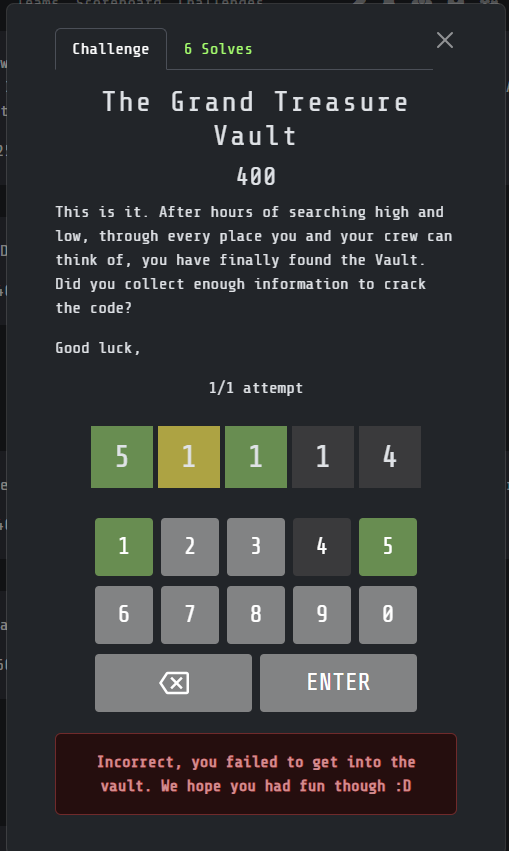
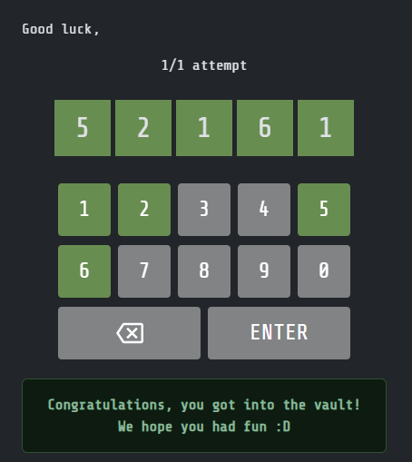

Custom challenge type plugin for CTFd, inspired by Wordle, used in ComSSA's 2025 ATR. Supports keypress and on-screen keys. Uses NYT code as referenced in `view.html`.

1. Place the `atr25_challenge` folder in your CTFd `CTFd/plugins/` directory.
2. Restart your CTFd server.
3. Create a challenge with a static 5-digit code as the flag.

To disable Rickrock on an incorrect guess, add the following to your theme header
```js
<script>
window["DISABLE_VIDEO"] = true;
</script>
```

Screenshots - Incorrect:



Screenshots - Correct:


